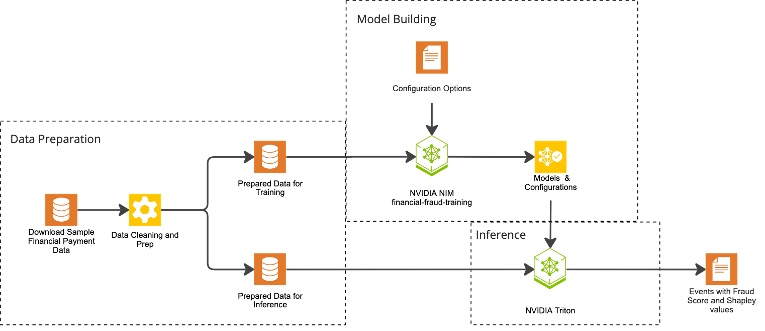

<h2>NVIDIA AI Blueprint: Financial Fraud Detection
</h2>

## Table of Contents

- [Overview](#overview)
  - [Software Components](#software-components)
  - [Target Audience](#target-audience)
  - [Prerequisites](#prerequisites)
  - [Hardware Requirements](#hardware-requirements)
- [Getting Started](#getting-started)
  - [Installation System Requirements](#installation-system-requirements)
  - [Obtain API key](#obtain-api-key)
  - [Clone The Repository](#clone-the-repository)
  - [Set up the environment file](#set-up-the-environment-file)
    - [API Key Environment variable](#api-key-environment-variable)
    - [Conda Environment](#conda-environment)
    - [Authenticate Docker with NGC](#authenticate-docker-with-ngc)
  - [Running the workflow](#running-the-workflow)
  - [Customizing the Workflow](#customizing-the-workflow)
- [License](#license)
- [Terms of Use](#terms-of-use)

<br>

__Notice__: This README is for users running the notebook locally and makes assumptions that the software can be installed on the hardware.


<br>


# Overview
Financial losses from worldwide credit card transaction fraud are [projected](https://www.paymentsdive.com/news/payments-fraud-losses-prevention-nilson-outlook/737440/) to reach more than $403 billion over the next decade. Transaction fraud poses a major challenge for financial institutions, which struggle to detect and prevent increasingly complicated fraudulent activities. Traditional fraud detection methods, which rely on rules-based systems or statistical methods, are reactive and increasingly ineffective in identifying sophisticated fraudulent activities. As data volumes grow and fraud tactics evolve, financial institutions need more proactive, intelligent approaches to detect and prevent fraudulent transactions.

This NVIDIA AI Blueprint provides a reference example to detect and prevent sophisticated fraudulent activities for financial services with high accuracy and reduced false positives. It shows developers how to build a financial fraud detection workflow using the NVIDIA container for fraud detection. For model building, the Financial Fraud Training container augments fraud detection using graph neural networks (GNNs)—a deep learning technique—for improved accuracy. Inference is done using the NVIDIA Dynamo-Triton (formerly Triton Inference Server) and produces fraud scores along with Shapley values for explainability. Furthermore, to help simplify the workflow, the Financial Fraud Training container also produces all the needed configuration files required by Dynamo-Triton. 




This NVIDIA AI blueprint is broken down into three steps, which map to processes within a typical payment processing environment, those steps are: (1) Data Preparation, (2) Model Building, and (3) Data Inference. For this example, the data is a collection of files containing synthetic data. Within a production system, the event data is often saved within a database or a data lake. The data is prepared and then fed into the [__financial-fraud-training container__](https://catalog.ngc.nvidia.com/orgs/nvidia/teams/cugraph/containers/financial-fraud-training) model-building container. The output of the NIM folder with all the artifacts needs to be passed to NVIDIA Dynamo-Triton for inference.

This blueprint does not use any NVIDIA hosted services and runs fully in a locally hosted docker environment.

<br>

## Software Components

### The following software components are used:

- [__financial-fraud-training__ container](https://catalog.ngc.nvidia.com/orgs/nvidia/teams/cugraph/containers/financial-fraud-training)
- [NVIDIA Dynamo-Triton](https://developer.nvidia.com/dynamo)

### Software Requirements
- Operating System: Ubuntu 20.04 or newer
- NVIDIA Driver version: 535 or newer
- NVIDIA CUDA version: 12.4 or newer
- NVIDIA Container Toolkit version: 1.15.0 or newer
- Docker version: Docker version 26 or newer


Everything is run via a Jupyter Notebook.

<br>

## Target Audience

This Blueprint targets users that:

- understand the financial fraud space
- understand how to deploy container-based microservices
- understands how to run a Jupyter notebook

This notebook is a simple example of how to orchestrate a financial fraud detection workflow that leverages the financial-fraud-training container. The notebook uses a synthetic dataset and produces the accuracy and a confusion matrix. Using real data in a production environment would not alter the workflow.

<br>

## Prerequisites

- [Obtain NVIDIA NVAIE key](#obtain-nvidia-nvaie-key)
- [CUDA 12.5+ drivers](https://developer.nvidia.com/cuda-downloads) installed

<br>

### Hardware Requirements

- GPU: 1x A6000, A100, or H100, minimum of 32 GB of memory 
- CPU: x86_64 architecture
- Storage: 10 GB
- System Memory: 16 GB


<br>

# Getting Started

## Installation System Requirements

- [git](https://git-scm.com/)
- [Jupyter Notebook or Jupyter Lab](https://jupyter.org/install)

Additional required Python packages are installed in the [conda environment](#conda-environment) step.

<br>

## Obtain API key

Here are two possible methods to generate an API key for NGC:

- Sign in to the [NVIDIA Build](https://build.nvidia.com/explore/discover?signin=true) portal with your email.
- Sign in to the [NVIDIA NGC](https://ngc.nvidia.com/) portal with your email.
  - Select your organization from the dropdown menu after logging in. You must select an organization which has NVIDIA AI Enterprise (NVAIE) enabled.
  - Click on your account in the top right, select "Setup" from the dropdown.
  - Click the "Generate Personal Key" option and then the "+ Generate Personal Key" button to create your API key.
    - This will be used in the NVIDIA_API_KEY environment variable.
    - Click the "Generate API Key" option and then the "+ Generate API Key" button to create the API key.

IMPORTANT: This will be used in the NVIDIA_API_KEY environment variable below.

- API catalog keys:
    NVIDIA [API catalog](https://build.nvidia.com/) or [NGC](https://org.ngc.nvidia.com/setup/personal-keys)

<br>

## Clone The Repository

   ```bash
   git clone https://github.com/NVIDIA-AI-Blueprints/Financial-Fraud-Detection
   ```

<br>

## Set up the environment file

### API Key Environment variable

   ```bash
   # Create the API environment
   export NVIDIA_API_KEY=your_key
   ```

Note: Add the environment variable to the `.bashrc` file to persist it beyond a single instance.

```bash
# to persist the key
echo "export NVIDIA_API_KEY=your_key" >> ~./bashrc
```

### Conda Environment

The workflow uses Conda to create an environment with all the needed packages. You can get a minimum installation of Conda and Mamba using [Miniforge](https://github.com/conda-forge/miniforge).

Create an environment using the following command, making sure that you are in the `Financial-Fraud-Detection` folder.

```bash
 mamba env create -f conda/notebook_env.yaml
```

Finally, activate the environment.

```bash
conda activate notebook_env
```


<br>

### Authenticate Docker with NGC

In order to pull images required by the Blueprint from NGC, you must first authenticate Docker with NGC. You can use same the NVIDIA API Key obtained in the [Obtain API key](#obtain-api-key) section (saved in the `NVIDIA_API_KEY` environment variable).

```bash
echo "${NVIDIA_API_KEY}" | docker login nvcr.io -u '$oauthtoken' --password-stdin
```

<br>

## Running the workflow

No command line option (CLI) is available without converting a Jupyter Notebook to a Python file.

Prerequisite: Start a browser

Starting Jupyter

__Option 1:__

```bash
   jupyter notebook
```

__Option 2:__

 Starting Jupyter Notebook with the notebook:

```bash
   cd notebook
   jupyter notebook financial-fraud-usage.ipynb
```

__Option 3:__

Starting Jupyter Labs

```bash
jupyter-lab

or 

jupyter-lab --ip=* --no-browser
```

In either case above, Jupyter will output status information. One key line is the URL:

```bash
$ jupyter notebook
   ...
   The Jupyter Notebook is running at: http://localhost:8888/
```

Via the browser, connect to the specified URL and process the notebook.


## Customizing the Workflow

The NIM offers a number of customization options. Detail on those can be found here (*** NEED LINK).  

<br>

# License

By using this software or microservice, you are agreeing to the [terms and conditions](https://www.nvidia.com/en-us/data-center/products/nvidia-ai-enterprise/eula/) of the [license](./LICENSE) and acceptable use policy.

# Terms of Use
GOVERNING TERMS: The NIM container is governed by the [NVIDIA Software License Agreement](https://www.nvidia.com/en-us/agreements/enterprise-software/nvidia-software-license-agreement/) and [Product-Specific Terms for AI Products](https://www.nvidia.com/en-us/agreements/enterprise-software/product-specific-terms-for-ai-products/).
