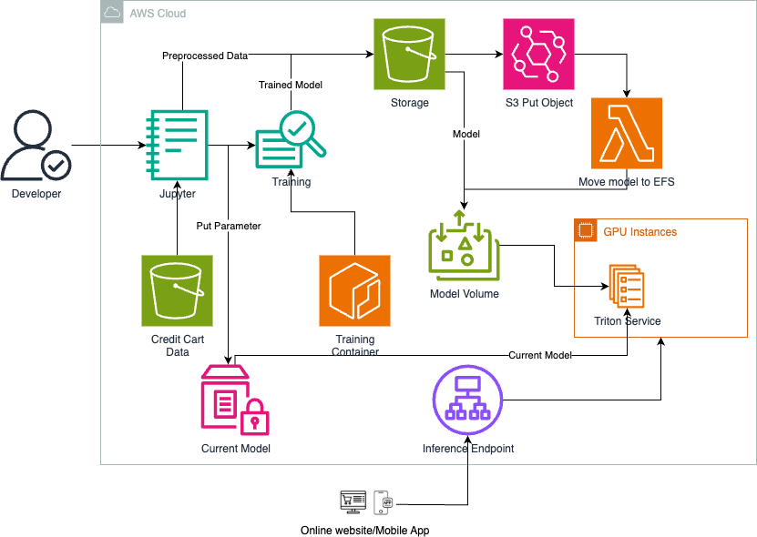

# GNN based financial fraud detection on AWS with Nvidia

Financial fraud costs institutions billions annually, and traditional rule-based systems struggle to keep pace with increasingly sophisticated attack patterns. This blueprint demonstrates a different approach: using Graph Neural Networks to analyze the relationships between transactions, merchants, and cardholders as a connected graph rather than isolated events.

The insight is simple. Fraudsters don't operate in isolation. They create patterns across multiple accounts, merchants, and time windows that become visible when you model transactions as a graph. A single suspicious transaction might look normal. That same transaction connected to a web of related activity tells a different story.



This implementation runs entirely on AWS using SageMaker Pipelines for orchestration, RAPIDS for GPU-accelerated preprocessing, and NVIDIA Triton for inference. The infrastructure deploys via CDK with a fully managed, serverless approach that eliminates cluster management overhead.

## The Pipeline

When you trigger a pipeline run, three stages execute in sequence.

**Preprocessing** transforms raw transactions into graph structure using RAPIDS. The TabFormer dataset (IBM's synthetic credit card dataset with 24 million transactions across 5,000 cardholders and 1,000 merchants) gets converted into a graph where cardholders and merchants become nodes, and transactions become edges. This runs on GPU-accelerated SageMaker Processing Jobs. What would take hours with pandas completes in minutes with cuDF.

**Training** combines a Graph Neural Network (GraphSAGE) with XGBoost for fraud prediction. The GNN learns embeddings from the transaction graph structure while XGBoost handles the tabular features. Together they outperform either alone. SageMaker Training Jobs orchestrate this on GPU instances, automatically handling checkpointing, metrics logging, and artifact storage.

**Model Registration** packages the trained model and registers it in SageMaker Model Registry with approval workflow. The model includes GNN weights, XGBoost model, and configuration for NVIDIA Triton inference serving. Models awaiting approval can be reviewed in SageMaker Studio before deployment.

## Getting Started

You'll need an AWS account with permissions for SageMaker, ECR, S3, IAM, CloudFormation, CodeBuild, and Secrets Manager. Locally you'll need Docker, Node.js 20+, Python 3.12+, AWS CLI v2, and `uv` for Python package management.

### Prerequisites

Install dependencies:

```bash
make install
```

Store your NVIDIA NGC API key (required to pull base images from NVIDIA GPU Cloud):

```bash
aws secretsmanager create-secret \
  --name nvidia-ngc-api-key \
  --secret-string "<your-ngc-api-key>" \
  --profile <your-aws-profile>
```

Bootstrap CDK (first time only):

```bash
cd infra && npx cdk bootstrap aws://<ACCOUNT>/<REGION> --profile <your-aws-profile>
```

### Deployment (Multi-Stage)

The CDK deploys multiple stacks with dependencies. Due to async CodeBuild image builds and the endpoint stack requiring a trained model, you cannot deploy everything in one shot. Follow this sequence:

**Stage 1: Deploy Infrastructure (without endpoint)**

Deploy the base infrastructure and image build pipelines. Skip the endpoint stack since no model exists yet:

```bash
cd infra
npx cdk deploy --all \
  --exclude SageMakerTritonEndpointStack \
  --profile <your-aws-profile> \
  --require-approval never
```

This creates:
- S3 buckets for data and models
- ECR repositories for custom containers
- CodeBuild projects that start building images automatically
- SageMaker execution roles
- SageMaker Domain for Studio access

**Stage 2: Wait for Container Images**

CodeBuild starts image builds automatically but they take 15-20 minutes. Wait for all three to complete:

```bash
# Check Triton image build
aws codebuild list-builds-for-project \
  --project-name triton-inference-image-build \
  --query 'ids[0]' --output text \
  --profile <your-aws-profile> | xargs -I {} \
  aws codebuild batch-get-builds --ids {} \
  --query 'builds[0].buildStatus' --output text \
  --profile <your-aws-profile>

# Check training image build
aws codebuild list-builds-for-project \
  --project-name sagemaker-training-image-build \
  --query 'ids[0]' --output text \
  --profile <your-aws-profile> | xargs -I {} \
  aws codebuild batch-get-builds --ids {} \
  --query 'builds[0].buildStatus' --output text \
  --profile <your-aws-profile>

# Check preprocessing image build
aws codebuild list-builds-for-project \
  --project-name sagemaker-preprocessing-image-build \
  --query 'ids[0]' --output text \
  --profile <your-aws-profile> | xargs -I {} \
  aws codebuild batch-get-builds --ids {} \
  --query 'builds[0].buildStatus' --output text \
  --profile <your-aws-profile>
```

All three should show `SUCCEEDED` before proceeding.

**Stage 3: Upload Training Data**

Download the TabFormer dataset and upload to S3:

```bash
# See notebooks/extra/download.md for download instructions
aws s3 cp card_transaction.v1.csv \
  s3://fraud-detection-<account>-sm/data/TabFormer/raw/ \
  --profile <your-aws-profile>
```

**Stage 4: Run the Training Pipeline**

Register and execute the pipeline:

```bash
make pipeline

aws sagemaker start-pipeline-execution \
  --pipeline-name FraudDetectionPipeline \
  --profile <your-aws-profile>
```

The pipeline takes ~25 minutes: PreprocessData (~15 min), TrainModel (~5 min), RegisterModel (~2 min). Monitor progress in SageMaker Studio or via CLI:

```bash
aws sagemaker list-pipeline-executions \
  --pipeline-name FraudDetectionPipeline \
  --profile <your-aws-profile>
```

**Stage 5: Deploy the Endpoint**

Once the pipeline completes and a model is registered, you can deploy. The endpoint stack will now succeed because model.tar.gz exists:

```bash
# Option A: Use Makefile (recommended - handles model registration)
make register  # Register latest model with Triton image
make deploy    # Deploy endpoint

# Option B: Deploy via CDK (uses fixed model path)
cd infra
npx cdk deploy SageMakerTritonEndpointStack --profile <your-aws-profile>
```

### Verification

Test the deployed endpoint:

```bash
make test                    # Quick smoke test
make test-real               # Test with real data from S3
make test-benchmark          # Include latency measurements
```

## Quick Reference

All commands run from the project root. The Makefile handles CloudFormation lookups automatically.

```bash
# Setup
make install              # Install CDK + Python dependencies
make info                 # Show current configuration

# Infrastructure
make cdk-list             # List all stacks
make cdk-deploy-all       # Deploy everything (may fail on first run - see above)
make cdk-diff             # Preview changes

# Pipeline
make pipeline             # Create/update pipeline definition

# Model & Deployment
make register             # Register new model version
make deploy               # Deploy endpoint
make deploy ENDPOINT_NAME=my-endpoint INSTANCE_TYPE=ml.g4dn.xlarge

# Image Building
make build-triton         # Rebuild Triton image
make build-training       # Rebuild training image
make build-preprocessing  # Rebuild preprocessing image
make build-all            # Rebuild all images

# Testing
make test                 # Run endpoint smoke tests
make test-real            # Evaluate on real test data from S3
make test-benchmark       # Include latency benchmark

# Utilities
make logs                 # Fetch latest endpoint logs
make clean-endpoints      # Delete all endpoint configs
```

Override the AWS profile or region with environment variables:

```bash
AWS_PROFILE=my-profile AWS_REGION=us-west-2 make deploy
```

## Understanding the Workflow

The `workflows/` directory contains the SageMaker pipeline definition:

```
workflows/
├── src/workflows/
│   ├── sagemaker_fraud_detection_pipeline.py
│   └── test_endpoint.py
├── pyproject.toml
└── uv.lock
```

SageMaker manages artifact passing between steps via S3:

```
┌──────────────────────┐
│  Raw Data (S3)       │
│  TabFormer Dataset   │
└──────────────────────┘
           │
           ▼
┌──────────────────────┐
│  Preprocessing       │
│  (Processing Job)    │
│  RAPIDS/cuDF on GPU  │
└──────────────────────┘
           │
           ▼
┌──────────────────────┐
│  Processed Data (S3) │
│  GNN graph + XGB     │
└──────────────────────┘
           │
           ▼
┌──────────────────────┐
│  Training            │
│  (Training Job)      │
│  GNN + XGBoost       │
└──────────────────────┘
           │
           ▼
┌──────────────────────┐
│  Model Registry      │
│  Versioning +        │
│  Approval workflow   │
└──────────────────────┘
           │
           ▼
┌──────────────────────┐
│  Triton Endpoint     │
│  Real-time inference │
│  + Explainability    │
└──────────────────────┘
```

The model is called `prediction_and_shapley`. It takes merchant features, user features, and graph edge information as inputs. It returns fraud probability plus Shapley values that explain which features contributed most to the prediction. This explainability matters for regulatory compliance and fraud analyst workflows.

## Troubleshooting

**CDK deploy fails on SageMakerTritonEndpointStack**

This stack requires a trained model at `s3://<bucket>/model-repository/model.tar.gz`. Skip it on first deploy with `--exclude SageMakerTritonEndpointStack`, run the training pipeline, then deploy the endpoint separately.

**Pipeline fails with "image does not exist"**

Container images build asynchronously. Wait for all three CodeBuild projects to complete (15-20 minutes after CDK deploy) before running the pipeline. Check status with `aws codebuild list-builds-for-project`.

**Endpoint returns 413 Request Entity Too Large**

The nginx proxy in Triton has a body size limit. For large inference batches, rebuild the image after updating `triton/nginx.conf` with a larger `client_max_body_size`.

**Test fails with "Endpoint not InService"**

Endpoint deployment takes 5-10 minutes. Check status with:
```bash
aws sagemaker describe-endpoint --endpoint-name fraud-detection-endpoint --profile <your-aws-profile>
```

## What's Next

The default hyperparameters work reasonably well, but you can tune them through pipeline parameters:

- `GnnNumEpochs`: More epochs generally improve accuracy but increase training time (default: 8)
- `XgbNumBoostRound`: XGBoost boosting rounds, higher values risk overfitting (default: 512)
- `GnnHiddenChannels`: Width of the GNN layers, larger captures more patterns (default: 32)
- `GnnNHops`: Number of graph neighborhood hops (default: 2)

Adjust these when starting a pipeline execution:

```bash
aws sagemaker start-pipeline-execution \
  --pipeline-name FraudDetectionPipeline \
  --pipeline-parameters \
    Name=GnnNumEpochs,Value=12 \
    Name=XgbNumBoostRound,Value=768 \
  --profile <your-aws-profile>
```

To use your own data, replace the `InputDataUrl` parameter with your S3 path. Ensure your CSV matches TabFormer's schema or modify `src/preprocess_TabFormer_sagemaker.py` for different data formats.

## Cleanup

Delete resources in reverse dependency order:

```bash
# Delete endpoint first
make clean-endpoints

# Then destroy stacks
cd infra
npx cdk destroy SageMakerTritonEndpointStack --profile <your-aws-profile>
npx cdk destroy SageMakerDomainStack --profile <your-aws-profile>
npx cdk destroy SageMakerInfraStack --profile <your-aws-profile>
npx cdk destroy TritonImageRepoStack --profile <your-aws-profile>
npx cdk destroy SageMakerTrainingImageRepoStack --profile <your-aws-profile>
npx cdk destroy SageMakerPreprocessingImageRepoStack --profile <your-aws-profile>
npx cdk destroy NvidiaFraudDetectionBlueprint --profile <your-aws-profile>

# Or destroy all at once (may require multiple runs if dependencies fail)
npx cdk destroy --all --profile <your-aws-profile>
```

S3 buckets are configured with auto-delete. You may need to manually delete SageMaker model packages from the registry before destroying infrastructure stacks.

## Contributing

See [CONTRIBUTING](CONTRIBUTING.md) for our contribution guide.

## Security

See [CONTRIBUTING](CONTRIBUTING.md#security-issue-notifications) for reporting security issues.

## License

MIT-0 License. See [LICENSE](LICENSE).

## Authors

- Shardul Vaidya, AWS Partner Solutions Architect
- Zachary Jacobson, AWS Partner Solutions Architect
- Ragib Ahsan, AWS AI Acceleration Architect
- Artiom Troyanovsky, Senior Machine Learning Engineer at Thoughtworks
