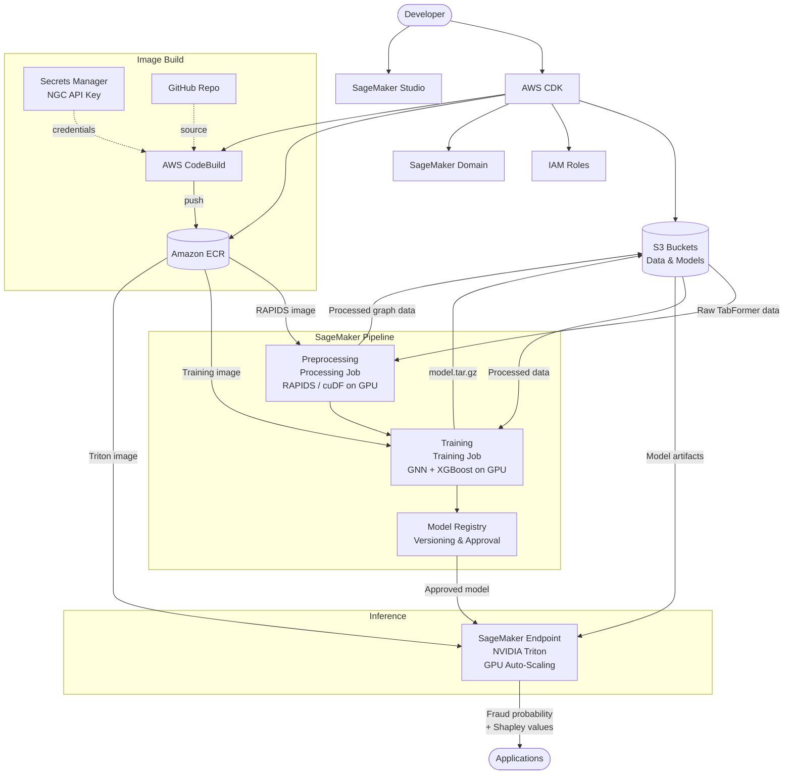

# AWS Architecture — GNN Fraud Detection (SageMaker Native)

```mermaid
flowchart TB
    %% ── Developer entry ──
    DEV([Developer]) --> CDK[AWS CDK]
    DEV --> STUDIO[SageMaker Studio]

    %% ── Infrastructure provisioning ──
    CDK --> S3[(S3 Buckets<br/>Data & Models)]
    CDK --> ECR[(Amazon ECR)]
    CDK --> IAM[IAM Roles]
    CDK --> DOMAIN[SageMaker Domain]
    CDK --> CB

    subgraph Image Build
        CB[AWS CodeBuild] -->|push| ECR
        SECRETS[Secrets Manager<br/>NGC API Key] -.->|credentials| CB
        GITHUB[GitHub Repo] -.->|source| CB
    end

    ECR -->|RAPIDS image| PREPROCESS
    ECR -->|Training image| TRAIN
    ECR -->|Triton image| ENDPOINT

    subgraph SageMaker Pipeline
        direction TB
        PREPROCESS[Preprocessing<br/>Processing Job<br/>RAPIDS / cuDF on GPU]
        TRAIN[Training<br/>Training Job<br/>GNN + XGBoost on GPU]
        REGISTER[Model Registry<br/>Versioning & Approval]
        PREPROCESS --> TRAIN --> REGISTER
    end

    S3 -->|Raw TabFormer data| PREPROCESS
    PREPROCESS -->|Processed graph data| S3
    S3 -->|Processed data| TRAIN
    TRAIN -->|model.tar.gz| S3

    S3 -->|Model artifacts| ENDPOINT
    REGISTER -->|Approved model| ENDPOINT

    subgraph Inference
        ENDPOINT[SageMaker Endpoint<br/>NVIDIA Triton<br/>GPU Auto-Scaling]
    end

    ENDPOINT -->|Fraud probability<br/>+ Shapley values| CLIENT([Applications])
```
