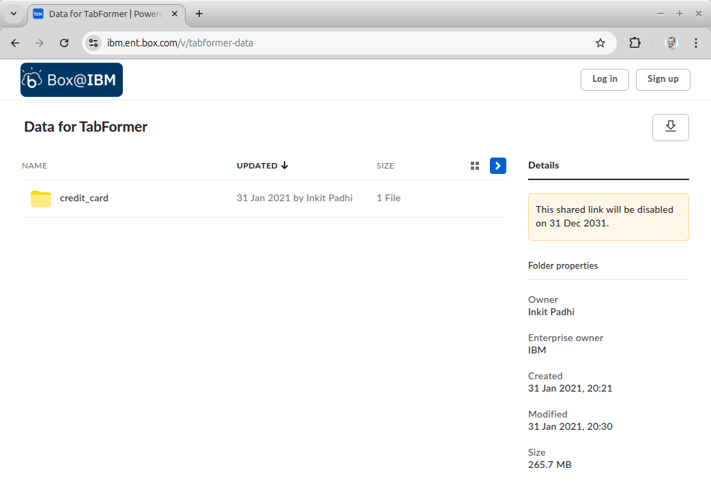
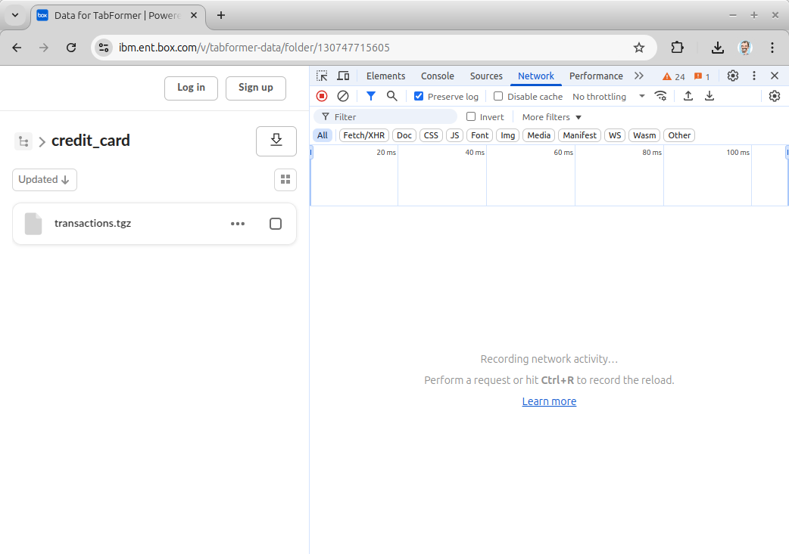
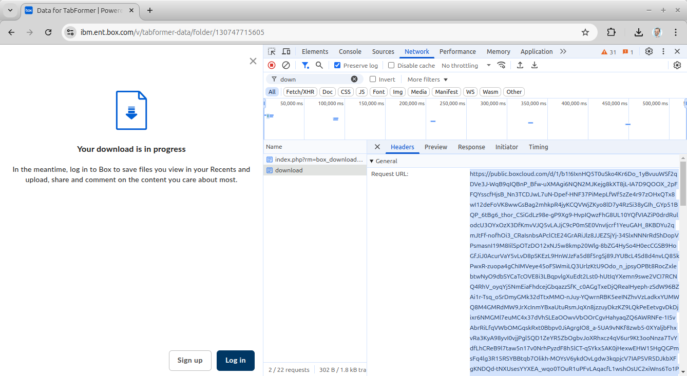

# Downloading the Test Data

The origin of the test data is [TabFormer git repository](https://github.com/IBM/TabFormer/tree/main/data/credit_card). The file is generally not downloadable from this location because of size and the use of [git-lfs](https://git-lfs.com/). We recommend downloading dataset via [Box](https://ibm.box.com/v/tabformer-data).

While this makes it fairly easy to retrieve the file for local use, it does make it a little more difficult to retrieve for testing in a container as this application expects. So, there are a few steps to get a download link for inserting in the download box.

## Step 1

Open a browser window and navigate to the box dataset [https://ibm.box.com/v/tabformer-data](https://ibm.box.com/v/tabformer-data). 

Right click in the webpage and select `Inspect`. When the developer tools opens, select the `Network`

## Step 2

In the webpage itself, click on the credit_card folder. 

You will see `transactions.tgz` when you point at the file a 3-button menu will show up and when you click that 3-button menu, a download dialog will pop up. 

Click download and after a moment the file should start downloading locally (this is fine, you can delete it after). 

In the network panel an entry will show up by the name `download`. Click the name `download` and the `Headers` panel will show up. In there you will find `Request URL`. Highlight the entire value (**this is the download URL**) and `copy` the URL. This is a temporary link that is provided. It has a time limit. It will look something like this: `https://public.boxcloud.com/d/1/{LOTS OF RANDOM LOOKING CHARACTERS}/download`

## Step 3

In the notebook set the value of `DOWNLOAD_URL` by pasting in the url you copied in step 2: `DOWNLOAD_URL="[the pasted url text goes in between these quotes, do not include these brackets]"`

